# *Unlocking Pricing Mastery: The Blueprint*

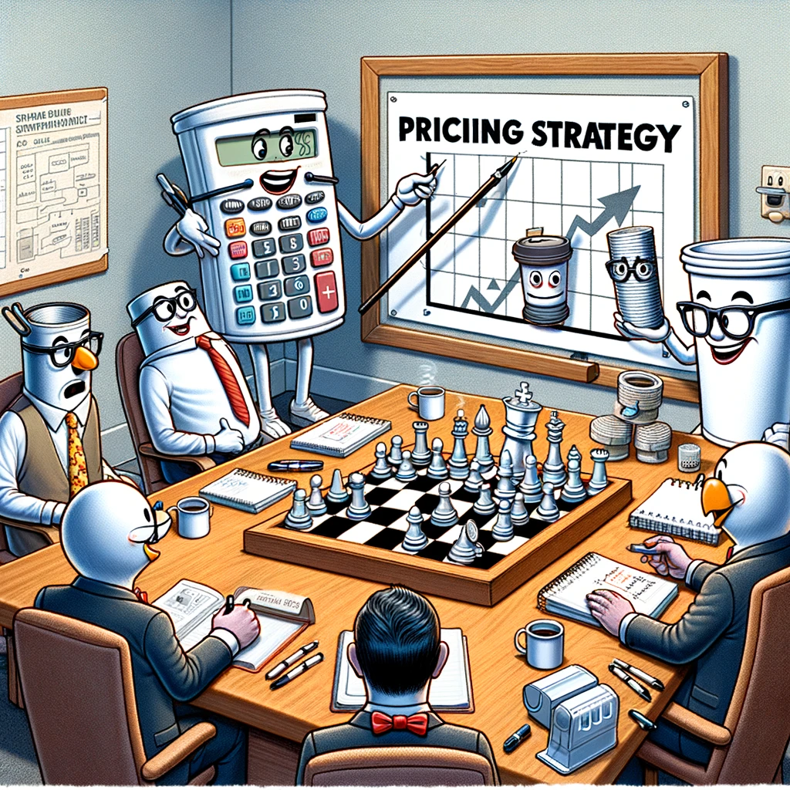

- [Why is important?](#why-is-important?)
- [Net Revenue Management](#Net-Revenue-Management)
- [The roadmap](#the-roadmap)
- [Case study](#case-study)
   + [data exploring](#data-exploring)
     + [notebook](data_exploring.ipynb)
   + [price elasticity](#price-elasticity)
     + [notebook](elasticity.ipynb)
   + [causalty](#causalty)
     + [notebook](casualty.ipynb)   
   + [forecasting](#forecasting)
     + [notebook](forecast.ipynb)

## Why is important?

A net revenue management agenda is crucial for any organization as it's all about boosting revenue by smartly handling pricing, promotions, and product availability to make the most profit. 

Here's why it's so important:

- **Maximizing Profits:** It helps ensure we're earning as much as possible from our products or services without turning away customers with overly high prices.

- **Optimizing Product Availability:** By making sure our products are available when and where customers want them, we avoid losing sales due to shortages or excess inventory.

- **Balancing Demand and Supply:** We can match our product supply with customer demand, adjusting prices and promotions to encourage sales during slow times or manage demand during busy periods.

- **Enhancing Customer Satisfaction:** Offering the right products at the right price and time improves customer happiness, leading to repeat business and positive word-of-mouth.

- **Competitive Advantage:** It gives us an edge by allowing us to respond swiftly to market changes, outsmart competitors, and grab more market share.

- **Data-Driven Decision Making:** By analyzing data on customer behavior, market trends, and competitor actions, we can make informed decisions to boost revenue and profits.

In a nutshell, a net revenue management agenda is absolutely essential for any organization because it helps us achieve our strategic and financial goals effectively.

## Net Revenue Management

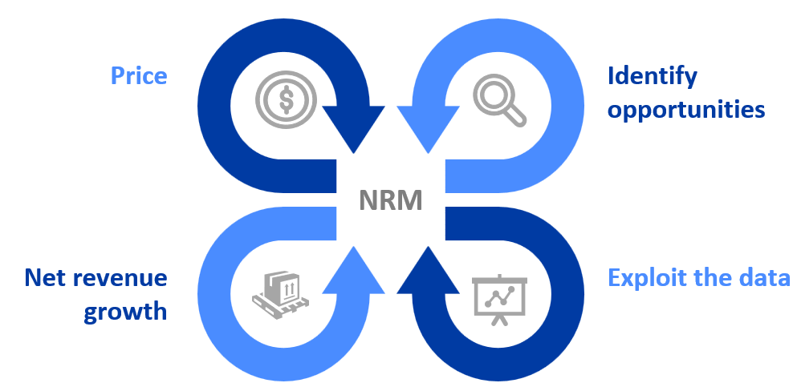

The points mentioned above highlight why implementing a **net revenue management (NRM)** agenda is crucial. However, what's equally important is understanding how to develop such an agenda. While **pricing** is the ultimate output of the program, the key lies in identifying opportunities through data analysis for **revenue growth.** 

Therefore, the most critical aspect is harnessing the power of data. Ultimately, **NRM** empowers organizations to effectively leverage available data for sustainable growth. In this article, we'll delve into the essential steps and considerations for begin to develop a successful NRM agenda that drives revenue growth through data utilization.

## The roadmap

*`1.-Brand portfolio pricing:`*
- The initial step in the revenue management roadmap involves understanding how pricing impacts demand.At this stage, it's crucial to consider factors like equity and our competitive advantage within the segment.Conducting an elasticity test is also essential to gauge market sensitivity to price changes. This helps answer the pivotal question: 
**"Which is the right price?"**.
  Also it's important to consider both market prices and competitor pricing during this phase of the roadmap.

*`2.-Price architecture`*
- another thing to consider is the next, the architecture of the price is important how need to be estructured the price and which price is the most attractive? in the last question is very common in some business to see prices with odd ending and during promotions times with 99 or 95 endings and this is very important because despite the elasticity is important to consider de psicologycal pricing and the current stage which is the most attractive price, also we need to consider that the endings not increase the demand all the time and not work by itself in all products in the article "Estimating the effect of odd pricing" from Philip Gendall show us that the price ending 99 is more effective for low-priced and fast-moving products
  
*`3.-Mix management`*
- The mix management stage is super important because we need a smart plan that considers all our different products (if we have them). This helps us find the best mix and make the most money. Remember how we talked about setting prices like \\$9.99 or \\$9.95 earlier? Well, that matters here too. We need to use different math tricks, like optimization algorithms, to find the best balance for all the stuff we're selling. We can use tools like linear programming to figure out the best way to do this.

*`4.-Promotion management`*
- When planning how to make more money, we need to think about promotions too. To do this, we can use a tool called marketing mix analysis. This helps us understand how things like advertising, prices, promotions, and discounts affect sales.

  It's really important to understand how each of these things affects how much people want to buy, and to know when, where, and why they decide to buy. This helps us see what makes people want to buy more, and what doesn't.

  To figure this out, we can use something called causal inference. This helps us understand if things like discounts actually make people buy more, or if things like Christmas make people want to buy more.
  
*`5.-Trade terms management`*
- In the final step of many businesses, we need to make sure that our commercial terms match our prices. In businesses that sell to other businesses (B2B), we can create a pricing plan with different levels. We start with a basic price, then adjust it based on how much demand there is. The goal is to come up with a pricing plan where both sides feel like they're getting a good deal.

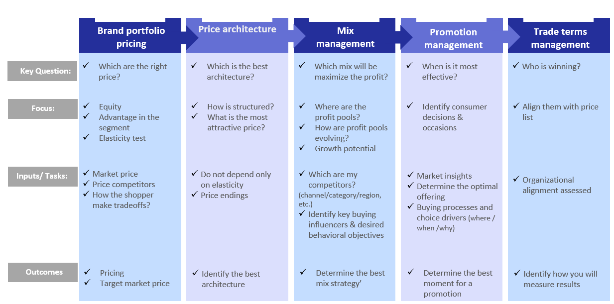

## Case study

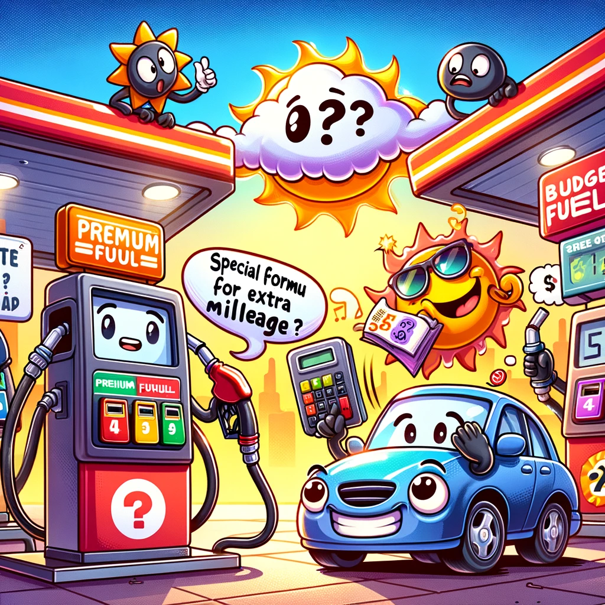

We're studying a gas site that sells three products. For this example, let's focus on just one product. We want to understand how its price affects demand and how other factors like holidays, days of the week, and even the impact of the COVID pandemic play a role.

Here's what our data includes:
- Date
- Day of the week
- Month
- Year
- Product
- Hour
- Volume sold
- Number of transactions
- Average volume per transaction
- Price
- Number of rainy days in the month
- Weekday number
- Weekend flag (assuming Thursday through Sunday)
- Holiday name

It's important to know that this data is synthetic and doesn't perfectly represent how a real business behaves.

### Data exploring

Price optimization means using past information to figure out the best price for something, like a product or service, that makes the most money for a company. Many things, such as who buys it, how much it costs to make, and what people say in surveys, affect how things should be priced. It also depends on the type of business and what it sells.

Companies often add new things or make improvements to make their product better, but this costs time, effort, and affects how people see the company.

So, it's really important to get the price right. If it's too high, people won't buy it, and if it's too low, the company loses money. Price optimization helps businesses find the right balance so they can make money and keep their customers happy.

*`correlation among variables`*

In this case study, we're sticking to the plan we made earlier. Our first task is to check out the data. When we start digging into the data, it's important to remember that just because two things seem connected, it doesn't mean one causes the other. But, figuring out how different things are linked can still tell us a lot.

For example, we're examining how prices relate to things like rainy days or holidays. We might check if prices change depending on who sets them first, or if sales change on weekends.

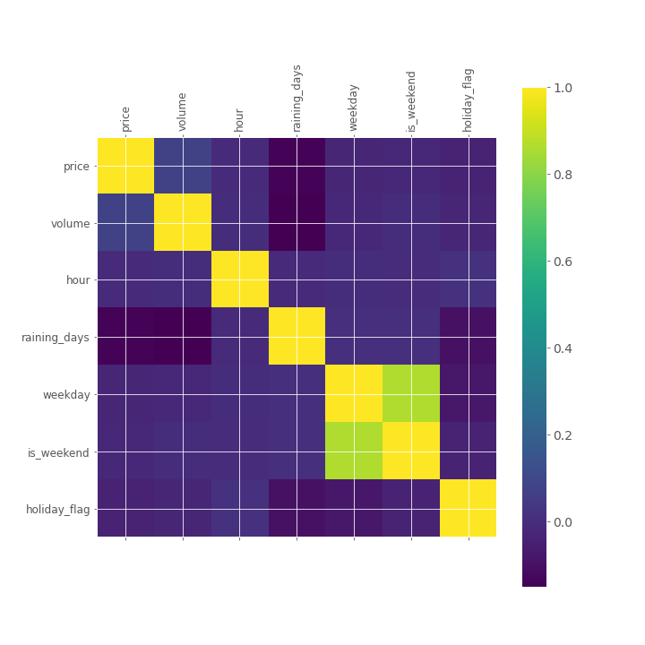

The chart above shows that there's not a strong connection between prices and sales. The correlation between them is almost 0, with a value of 0.07. This means there's not much special going on there. On the other hand, rainy days seem to have a slight negative connection with sales, suggesting that when it rains, sales might drop a bit. The same goes for holiday days and different days of the week, but these correlations are also close to zero, so they're not very significant. Right now, the only clear thing we see is that sales tend to dip when it's raining, but we can't say it's causing the decrease for sure.

Now, we're moving on to the next step: understanding how sales behave over time. The goal here is to get a feel for any patterns or trends that might help us predict future sales. Looking at the chart, we can see a decrease in sales towards the end of 2019, and a big drop during the spring of 2020. This drop in spring is because of a lockdown due to the COVID emergency, with some days showing a peak in demand.

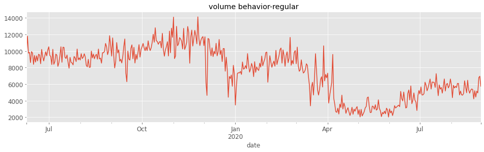

As mentioned earlier, at the end of 2019, there was a decline in sales, followed by a period of stability for the first two months of 2020. Then, sales dropped again during the COVID lockdown. In the seasonal analysis, there's a decrease in sales each month, but this might be influenced by the sharp decline in November 2019. We need to explore further to understand why that happened. At this point, we can't definitively say if there's a consistent trend in sales.

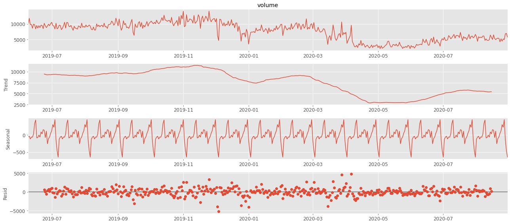

As depicted in the following chart, the price experienced a decline during the spring of 2020. However, despite subsequent price increases, sales also rose. This suggests a positive elasticity, indicating that sales tend to increase with price hikes. Notably, this behavior was observed post-lockdown. The chart provides valuable insights into the relationship between sales and pricing dynamics.

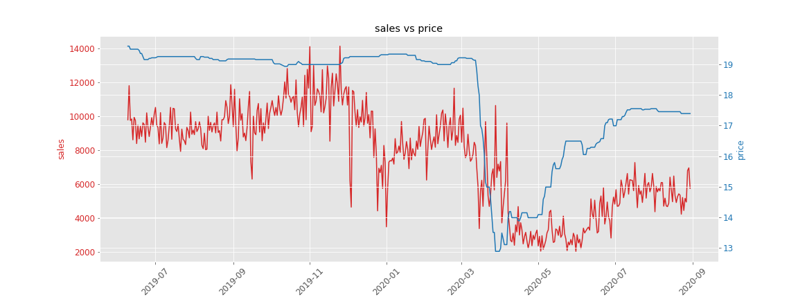

The following charts illustrate sales patterns across specific days and throughout a typical day. It's evident that the majority of sales occur during typical working hours, which is unsurprising. Client traffic peaks between 6 am and 9 pm, possibly extending to 10 pm, with the most significant activity observed between 8 am to 10 am and 5 pm to 6 pm.

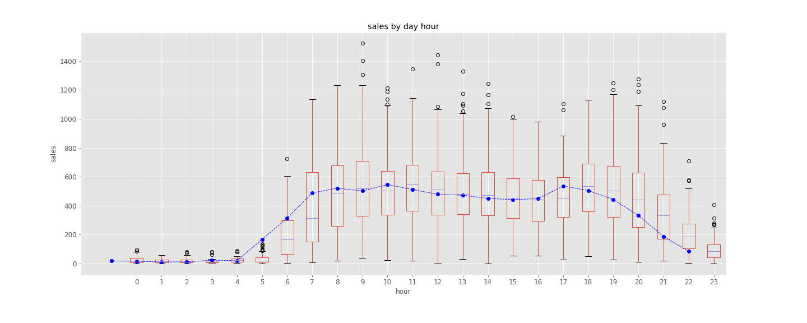

In terms of the day of the week, the data suggests that the majority of clients purchase gasoline at the beginning and end of the week. This indicates that price increases could be implemented during these periods, considering the surge in sales. However, a deeper analysis is necessary to determine if there's a causal relationship driving these sales patterns.

The following chart provide insights into the impact of rainy days on sales. It's noticeable that on days with minimal rainfall, there is an uptick in the average sales. Now, the task at hand is to ascertain whether rainfall directly influences an increase or decrease in sales.

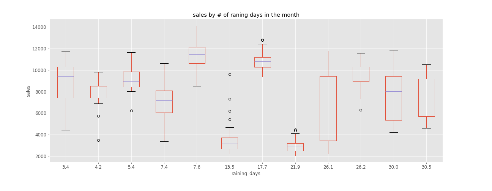

Despite having only a small sample size to gauge the impact on sales, at a surface level, we cannot determine whether sales are increasing or decreasing.

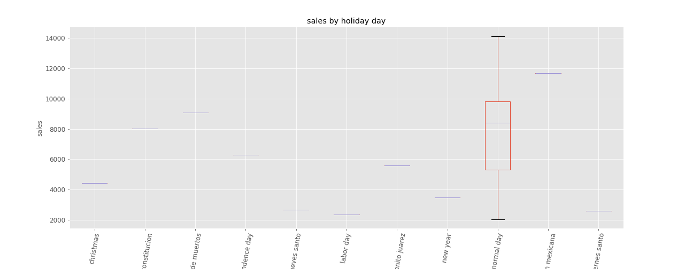

`Insights`  
From the data depicted in the above charts, several insights emerge. Firstly, there's a notable preference for heightened sales at the beginning and end of the week. This trend could be linked to customers refilling their vehicles for regular commuting at the week's outset and preparing for weekend outings towards its conclusion. Additionally, sales patterns exhibit sensitivity to rainy days, with fewer rainy days correlating with increased sales averages.

Moreover, while the dataset is limited, it suggests that holidays influence sales, with Mexican Revolution Day notably showing higher averages. This uptick could be attributed to heightened travel activity during holiday periods, prompting more individuals to refuel.

Building upon these observations, a pricing strategy could be devised. Adjusting prices slightly upward at the week's start and end, aligning with demand fluctuations, could be beneficial. Similarly, during months with fewer rainy days, implementing price adjustments could be considered. However, it's essential to acknowledge that these are preliminary assumptions, necessitating further causal analysis for validation.

 

`Simulating scenearios`

Before delving into that, let's consider the potential scenarios through Monte Carlo simulations, this method offers versatile applications, including:

- *Uncertainty Management:* Sales forecasts inherently carry uncertainty due to various factors like market conditions and customer behavior. Monte Carlo simulation helps model this uncertainty by generating multiple scenarios, offering insights into the range of possible outcomes.

- *Risk Analysis:* By simulating sales under different scenarios, you can assess associated risks. This aids in identifying and preparing for potential challenges that may affect sales performance adversely.

- *Decision Making:* Monte Carlo simulation provides insights into the likelihood of achieving sales targets, enabling informed decision-making. This includes setting realistic targets, resource allocation, and determining pricing strategies based on simulation results.

- *Scenario Planning:* Through Monte Carlo simulation, you can explore different scenarios by adjusting input parameters. This aids in evaluating the impact of various strategies or actions on sales performance, facilitating robust and adaptive planning.

- *Optimization:* Monte Carlo simulation, when combined with optimization techniques, helps identify optimal strategies or decision variables to maximize sales performance. By iteratively simulating scenarios and adjusting variables, solutions that balance risk and reward can be found effectively.

In our case, we aim to explore potential scenarios for the upcoming seven days.

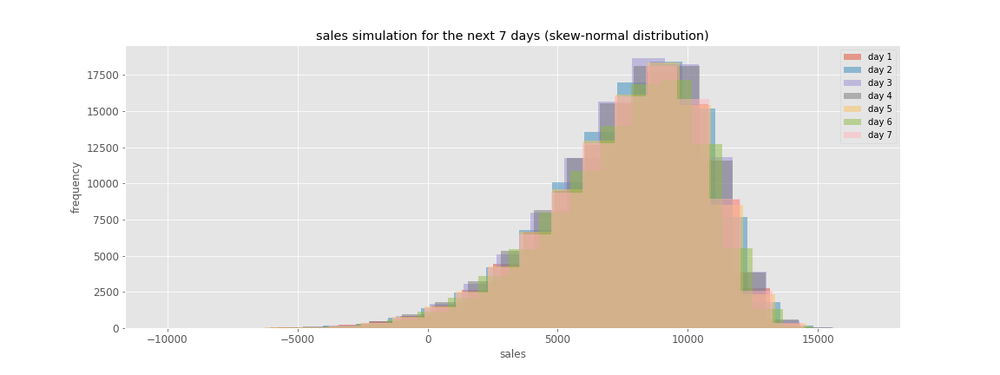

From the chart above, we observe 10,000 simulated scenarios representing sales for the next 7 days. It's notable that the majority of these scenarios predict sales volumes above 5,000 liters and near to 10,000.

### Price elasticity

Understanding elasticity holds immense importance in economics as it offers insights into how responsive people are to changes in prices or other variables. Elasticity can be envisioned as a gauge of the extent of reaction to change. In this context, we're specifically referring to how demand for a product or service fluctuates in response to alterations in its price.

High elasticity implies that people significantly adjust their purchasing behavior in response to price fluctuations. Conversely, low elasticity suggests minimal changes in buying habits, even when prices vary. This concept is pivotal for both businesses and policymakers. For businesses, awareness of their product's elasticity aids in setting prices strategically. If demand is elastic, caution is warranted in price hikes to avoid substantial sales declines. Conversely, if demand is inelastic, pricing strategies can be more flexible.

In essence, elasticity serves as a measure of consumers' sensitivity to price alterations, thereby assisting businesses and policymakers in making informed decisions.

Analyzing the data from the charts we've seen earlier, it seems that there might be a relationship between price changes and demand fluctuations.

Looking ahead, our main goal is to understand this relationship, especially considering the extraordinary circumstances such as the ongoing pandemic. By taking into account the timing of the pandemic and its effects on consumer behavior, we hope to uncover how demand elasticity has been influenced.

`price vs sales`

Exploring the dynamics of product elasticity amidst the backdrop of a pandemic-induced lockdown reveals intriguing insights. Observing the chart below, it becomes evident that the product exhibits characteristics of inelasticity. Despite a higher price point, sales remain robust, indicating a lesser degree of responsiveness to price changes. However, it's crucial to note that this trend is intricately tied to the unique circumstances of the lockdown imposed due to the pandemic. Let's delve deeper into the implications of this phenomenon.

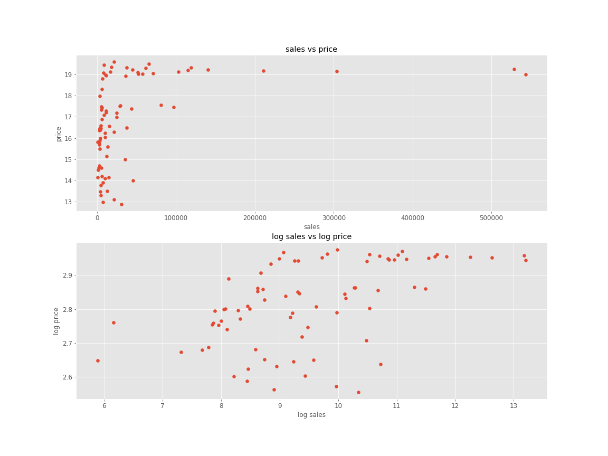

In the charts above, we can discern the connection between price and sales, as well as these variables when logged.

`OLS model`

The next step involves determining the sensitivity of sales to price changes, taking into account the following relation:

$$
Y = \beta_0 + \beta_1X_i
$$

where $\beta_0$ is the intercept and $\beta_1$ represents the price sensitivity, it's important to note that the relationship isn't a straightforward percentage proportion and doesn't directly represent elasticity. *Elasticity,* in essence, measures the percentage change in sales relative to the percentage change in price. To achieve that, we must take into account the following relationship:

$$
ln(Y) = ln(\beta_0) + ln(\beta_1*X_i)
$$

Ultimately, we'll arrive at the following equation.

$$
ln(Y) = \beta_0 + \beta_1ln(X_i)
$$

Now, with the logarithmic relationship between sales and prices, we can derive the elasticity, represented by $\beta_1$.

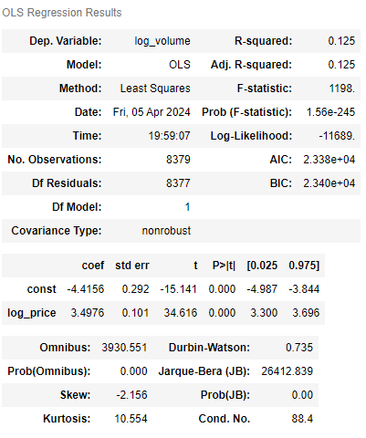

Following the OLS regression, we find a coefficient of *3.49* for $\beta_1$, indicating an elasticity of *3.49.* This suggests that sales tend to rise alongside price increases. However, this assumption may not hold true in a typical market where elasticity is negative. The observed positive effect could be attributed to the transition out of lockdown and the resumption of economic activity. During this period, both prices and sales may have increased. Nonetheless, it's crucial to acknowledge that the impact of price on sales could be minimal.

To gain a better understanding of elasticity behavior, we attempt to forecast the volume using the following equation:

$$ Y = \alpha P^b $$
where
$$\alpha=e^a$$
and, where *a* represents the intercept of the Ordinary Least Squares (OLS) model and *b* signifies the elasticity.

*Note: Keep in mind that for the present model, we are solely taking the price into consideration as a variable.*

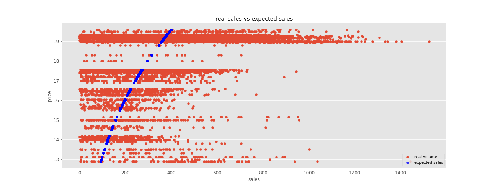

As depicted in the chart above, our model's predictive accuracy regarding volume is not particularly high. However, it does provide insight into volume trends, particularly when considering price fluctuations.

It's important to acknowledge that our output is influenced by various factors such as time of day, day of the week, and weather conditions, not solely reliant on price.

`optimal price`

One crucial aspect of running a business is determining the ideal selling price. With the current sales model:

$$
demand=\alpha price^b
$$

our aim is to estimate the optimal price.However, before proceeding, we must also analyze the price dynamics and incorporate the final costs into our considerations.

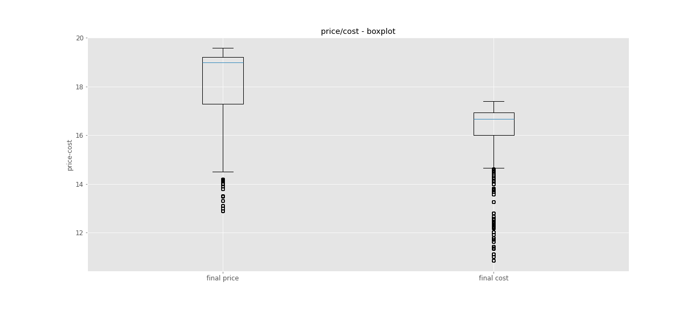

As illustrated in the box plot, our median price is slightly above \\$19, with a few outliers below \\$14. However, these outliers are uncommon and likely result from the notable cost reductions during the COVID-19 pandemic. With our positive elasticity, we lean towards setting price limits between \\$17.99 and \\$23.99. This range strikes a balance, allowing us to sustain profitability while responding to pandemic-driven shifts in market dynamics.

For the next step we try with Bayesian optimization to refine our pricing strategy. This method aims to approximate the optimal solution by utilizing probabilistic functions. By leveraging Bayesian optimization, we strive to navigate the intricate realm of pricing decisions efficiently. Our approach relies on probabilistic reasoning to help us maximize our desired outcomes effectively.

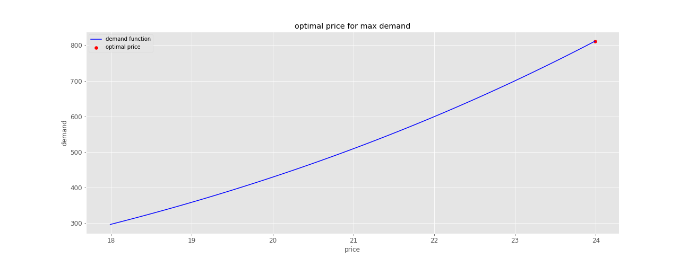

<!-- #region -->
As observed in the graph, our analysis points to an optimal price of $23.99, which aligns closely with our elasticity coefficient of 3.49. This coefficient indicates a positive correlation between price and sales, implying that higher prices correspond to increased sales. However, it's important to acknowledge that this may not fully capture the complexity of the market dynamics. While recent data show a rise in sales despite price increases, historical sales patterns suggest that initial price adjustments had minimal impact on sales. This suggests a market that may be less responsive to price changes, hinting at a degree of inelasticity.

Moreover, our current demand model focuses solely on price, overlooking potential factors that could also influence sales. Incorporating additional variables could lead to a more comprehensive and accurate model. Nevertheless, our current findings suggest that our market may not be as price-sensitive as initially assumed.

Currently, we're solely focusing on the initial stage of our roadmap, which involves factoring in price elasticity to address the question, *What is the appropriate price?*

However, we acknowledge the absence of crucial information such as market prices. While this information is currently unavailable to us, it's vital for consideration in our decision-making process.
<!-- #endregion -->

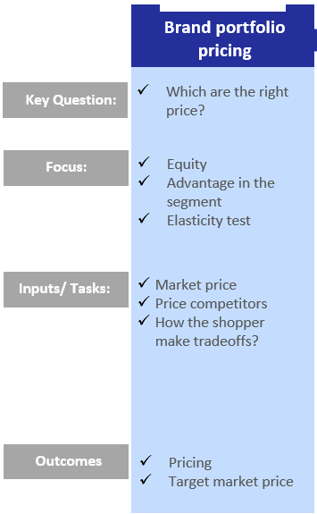

### Causalty

In the realm of business, setting the optimal **price** for a product or service requires finesse. It's not merely about selecting a figure at random; it involves comprehending **how that price point will affect consumer behavior** and, ultimately, the company's financial performance. This is where causality comes into play. In the following discourse, we will delve into the concept of causality and elucidate its pivotal role in shaping pricing strategies for businesses.

Picture yourself managing a lemonade stand on a scorching summer day. You're confronted with a pivotal choice: What should be the price of a cup of refreshing lemonade? If the price is set too high, potential customers might perceive it as too costly and opt not to buy. Conversely, if the price is too low, you may attract a crowd but struggle to cover your expenses. This scenario vividly highlights the significance of causality—the intricate cause-and-effect relationship between price adjustments and consumer behavior.

An understanding of **causality empowers businesses** to make informed decisions regarding **pricing strategies.** By scrutinizing how alterations in price impact the demand for their offerings, businesses can strike a harmonious balance between enticing customers and maximizing profitability.

Throughout this section, we will examine real-world scenarios and offer practical insights to underscore the importance of **causality in pricing strategies.** Additionally, we will explore how businesses can leverage this understanding to accomplish their objectives. 

`EconML`

Short for Economic Machine Learning, is a game-changer in economic analysis. By combining economic principles with the computational muscle of machine learning, it helps us understand how different factors affect sales.

This approach allows researchers and policymakers to dig deep into complex data, revealing cause-and-effect relationships in the real world. With EconML, policymakers can evaluate policies more accurately, estimate treatment effects better, and explore "what-if" scenarios more effectively. By bridging economics and machine learning, EconML is set to transform economic analysis and improve decision-making processes.

Link: https://econml.azurewebsites.net/

<!-- #region -->
After grasping the essence of economics and understanding its utility, the initial step entails identifying treatment effects, features, outcomes, and confounders.

- *outcome:* In EconML, the outcome refers to the variable we are trying to predict or understand. For example, if we are studying the effect of a product's price on sales, the outcome would be the sales figure. It's the variable we aim to comprehend or forecast regarding how it's impacted by other variables.

- *treatment effect:* The treatment effect is the change in the outcome caused by the treatment or intervention under study. For instance, if we're examining the price's effect on sales, the treatment effect would denote how much the sales vary when the product's price changes.

- *features:* Features are the variables we use to predict or understand the outcome and treatment effect. They are the data characteristics believed to be related to the outcome and/or treatment effect. For instance, when studying the price's effect on sales, features could include the day of the week, weather conditions, season, etc.

- *confounders:* Confounders are variables related to both the treatment and outcome, which can introduce bias into the treatment effect estimation if not adequately controlled. It's crucial to control for confounders in causal analysis to ensure precise treatment effect estimation. For example, in studying the price's effect on sales, advertising could be a confounder as it may relate to both price and sales, potentially biasing our treatment effect estimation if not properly controlled.

For our specific case study, the variables are as follows:

- *outcome:* volume
- *treatment effect:* price
- *features:* weekday, is_weekend, raining_days, holiday_flag
- *confounders:* hour, covid

For our initial approach, we employ the `LinearDML estimator.` Since we lack specific assumptions about these models, we opt for a versatile gradient boosting estimator to glean insights into the expected price and demand from our dataset.
<!-- #endregion -->

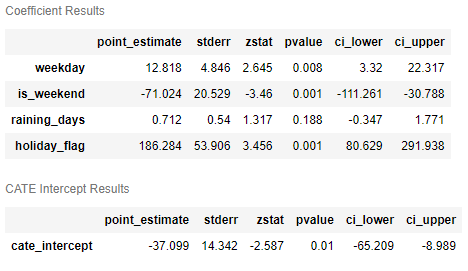

Observations from the table reveal several noteworthy patterns:

- Weekdays exhibit a considerable influence on sales.
- Sales typically surge on weekdays and decline during weekends.
- Sales tend to escalate during holidays, attributed to increased travel and customers filling their tanks before departing the city.
- However, the impact of rainy days on sales is not always consistent.
- Significantly, **price consistently correlates with reduced sales,** implying that higher prices result in lower sales. This relationship is statistically significant, indicating a causal effect on sales rather than random chance.

Based on the following chart, it's clear that while certain features suggest a causal relationship, the accuracy of forecasting the treatment effect is lacking. To rectify this, we implement a causal forest model to more effectively capture the potential nonlinear relationships between features and the treatment effect.

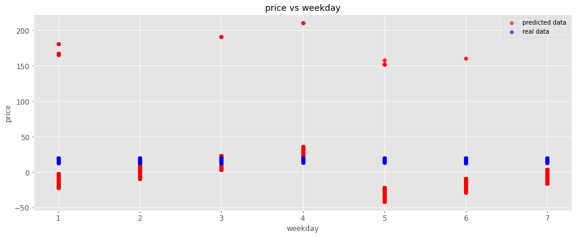

The disappointing predictions from the causal forest model prompt us to re-examine our initial linear model. It's important to emphasize the causal forest's strength in capturing nonlinear relationships between variables and the output.

Additionally, it's worth noting that we've only been considering one degree for the linear DML model so far. However, expanding to incorporate more degrees could prove beneficial.

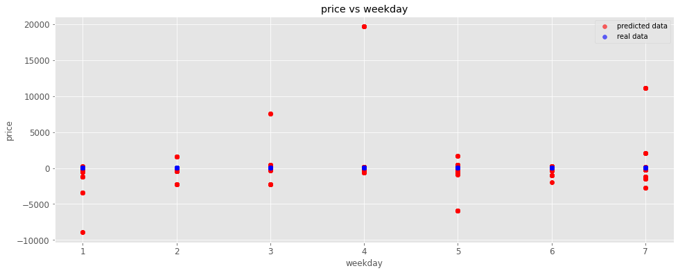

At present, our focus has been solely on the linear model. However, for a more comprehensive understanding of the model's predictive mechanisms, we can utilize the CATE interpreter showcased in the following image.

As observed in the chart below, the initial split is based on rainy days. Subsequently, as illustrated in the table above, weekdays emerge as a crucial factor in forecasting a high or low CATE (Conditional Average Treatment Effect). This correlation aligns logically with the positive relationship between weekdays and sales, which is not merely incidental but substantiated by data. To establish a **data-driven pricing strategy,** we proceed with the policy interpreter.

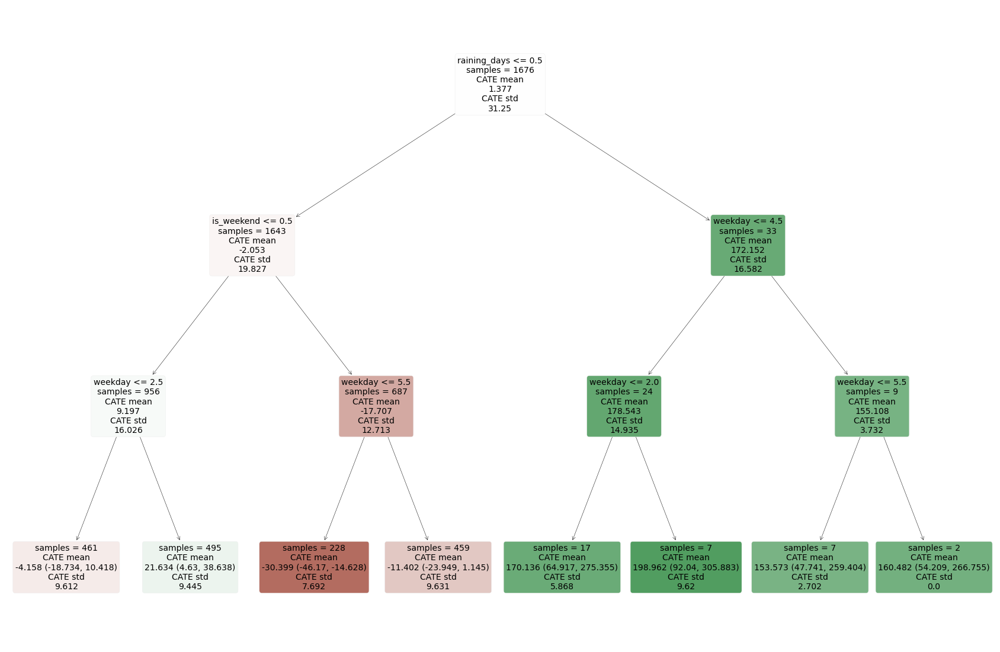

Another aspect to consider is that `EconML` features a policy interpreter capable of taking both treatment costs and treatment effects into account. This interpreter helps to derive straightforward rules for targeting customers profitably, the initial data segmentation is based on identify weekends, with subsequent branching hinging on number of weekday. Notably, there's a discernible upward trend in mean CATE corresponding to higher day numbers.

When employing a policy interpreter that considers treatment costs and effects to discern profitable customer targeting strategies, several patterns emerge: In many cases, adopting a lower **pricing strategy proves beneficial.** However, when the count of rainy days is less than or equal to 10.55, it's advisable to raise prices. Moreover, the analysis highlights the importance of other causal variables such as weekdays and holidays. For instance, holidays, estimated with a point estimate of 186, suggest implementing a price increase strategy during those periods.

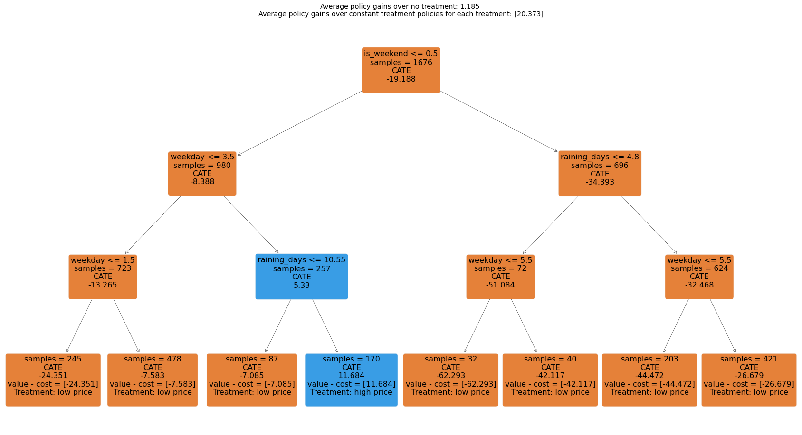

### Forecasting

Forecasting sales is crucial in revenue and pricing strategy because it helps businesses plan effectively for the future, for exmaple:

- *Strategic Resource Allocation:* By anticipating future sales, businesses can allocate resources, this ensures that they have the necessary resources in place to meet demand without overcommitting or underutilizing resources.

- *Price Optimization:* Understanding future sales trends allows businesses to set prices strategically. We can adjust prices based on anticipated demand fluctuations, competitor actions, and market conditions to maximize revenue and profitability.

- *Market Expansion Strategies:* Sales forecasts provide valuable insights into potential market opportunities and growth areas. Businesses can use this information to identify new target markets or launch new products in line with projected demand.

- *Risk Mitigation:* By forecasting sales, businesses can identify potential risks and uncertainties in their revenue streams. This enables them to develop contingency plans and mitigation strategies to address potential challenges and minimize their impact on business operations.

- *Performance Evaluation:* Sales forecasts serve as benchmarks against which actual performance can be measured. By comparing actual sales figures to forecasted values, businesses can evaluate the effectiveness of their strategies, identify areas for improvement, and make necessary adjustments to enhance future performance.

Prior to delving into predictions, it's crucial to grasp the behavioral patterns and operational dynamics. As depicted in the chart above, certain hours register zero sales, which is expected considering not all hours witness customer transactions. Fluctuations in demand are observable, with some periods experiencing surges while others decline. Although the chart spans only 30 days, it offers insights into sales trends. Furthermore, the trend chart reveals recurring patterns in sales declines, aligning with observed sales behavior.

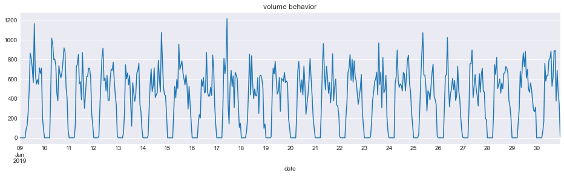

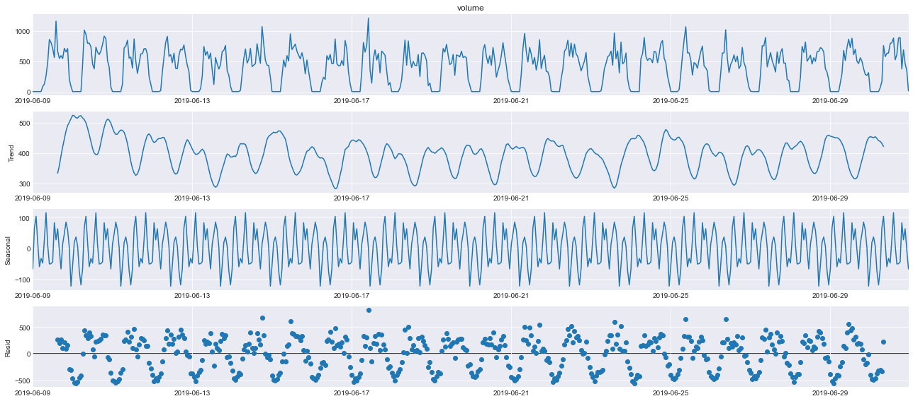

We've conducted additional analyses to deepen our understanding of the data's behavior. Autocorrelation analysis assesses whether a data series correlates with its past values, unveiling patterns where historical data influences future outcomes. In contrast, partial autocorrelation isolates the direct relationship between two time points while accounting for intermediary influences. These analyses are invaluable in time series data, shedding light on how past observations shape future trends. This insight is essential for making precise predictions in fields such as finance, weather forecasting, and sales forecasting.

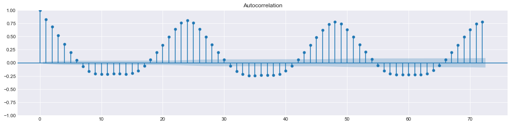

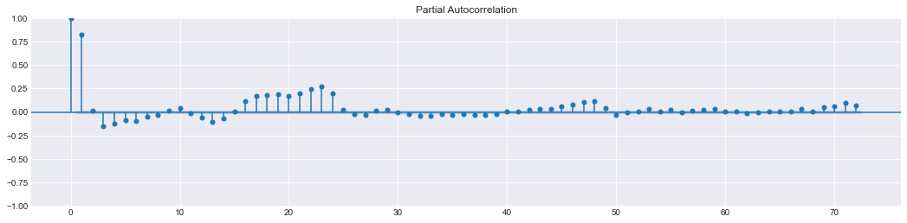

Upon scrutinizing the autocorrelation chart, a discernible positive correlation emerges between the sales of a particular hour and those of preceding hours. Furthermore, a correlation is noted between sales at a specific hour and sales during the same hour on preceding days.

`baseline`

At this juncture, our main objective is to establish a foundational benchmark for our sales forecasting endeavors. This baseline acts as a fundamental reference, offering a simple yet effective means to anticipate future sales trends. In our case, we opt for a naive forecasting approach, using historical sales data to guide our predictions. Through this method, our goal is to gain insight into sales patterns, paving the way for the adoption of more advanced forecasting techniques down the line.

`naive forecast`

A naive forecast is akin to making a simplistic projection of the future solely based on past occurrences. It's akin to predicting tomorrow's weather by assuming it will mirror today's conditions—no unexpected changes anticipated. Similarly, in sales forecasting, a naive approach might involve predicting tomorrow's sales to match today's figures. While rudimentary, it offers a foundational starting point for predictions, albeit without considering intricate variables.

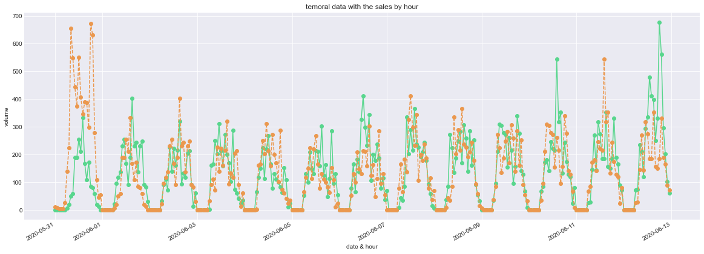

When appraising our baseline model, a critical metric to consider is the baserate, acting as a yardstick for assessing our predictive prowess. In our present scenario, the baserate manifests as our Mean Absolute Error (MAE), currently standing at 77.65. Essentially, this indicates that, on average, our predictions deviate from the actual values by approximately 77.65 units. Hence, our objective is to refine our baseline model to achieve an MAE below this threshold, thereby elevating its predictive precision and surpassing the baserate. This marks a pivotal stride in our endeavor to cultivate more resilient forecasting models.

<!-- #region -->
`skforecast`

As we advance to the next phase of refining our predictions, we're thrilled to introduce SKForecaster into our toolkit. SKForecaster is a robust tool crafted for generating forecasts through data analysis—a modern-day crystal ball for numbers, if you will! By supplying SKForecaster with pertinent data, such as historical sales data or weather patterns, we can leverage its predictive prowess to anticipate future outcomes. Whether it's supporting businesses in strategic planning or aiding meteorologists in forecasting tomorrow's weather, SKForecaster simplifies the process by handling all the intricate calculations behind the scenes. All you need to do is input your data, sit back, and let SKForecaster work its magic, offering valuable insights into what lies ahead.

`LGBM (light gradient-boosting machine)` 

Now that we have a comprehensive understanding of the algorithms in our arsenal, we can proceed with our analysis. In our examination, we've identified that the Mean Absolute Error (MAE) from the forecast (MAE:11,061.8) slightly exceeds that of the baseline. Before determining the model to deploy, fine-tuning is essential. Although the current MAE from the baseline seems adequate, particularly for scenarios involving seasonal data, our aim is to pursue a more refined approach. This involves leveraging the capabilities of the skforecast framework, underscoring our dedication to enhancing forecast accuracy and precision.

Upon reviewing the accompanying chart, it becomes apparent that the model's accuracy may not be optimal. However, a closer scrutiny of the forecast reveals variations that offer valuable insights into sales behavior. While the model generally aligns with the sales trend, occasional deviations are evident. Although it captures the essence of the trend, there are instances where improved accuracy could yield significant benefits.
<!-- #endregion -->

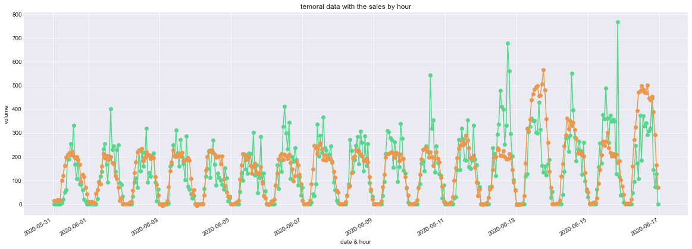

In our endeavor to boost the accuracy of our forecasting model, we're diving into the realm of fine-tuning techniques. This entails experimenting with different hyperparameters to fine-tune the performance of our model. By engaging in meticulous exploration and iteration, our goal is to pinpoint the optimal combination of hyperparameters that produce superior results. After evaluating various options thoroughly, we'll cherry-pick the top-performing model from the array of candidates generated. This rigorous process ensures that we deploy the most polished and accurate forecasting model, thereby equipping us to make informed decisions based on dependable predictions.

Following our fine-tuning efforts, the Mean Absolute Error (MAE) still exceeds the baseline rate *(MAE: 10,983.87).* Currently, our forecasting strategy relies solely on sales data without integrating additional variables.

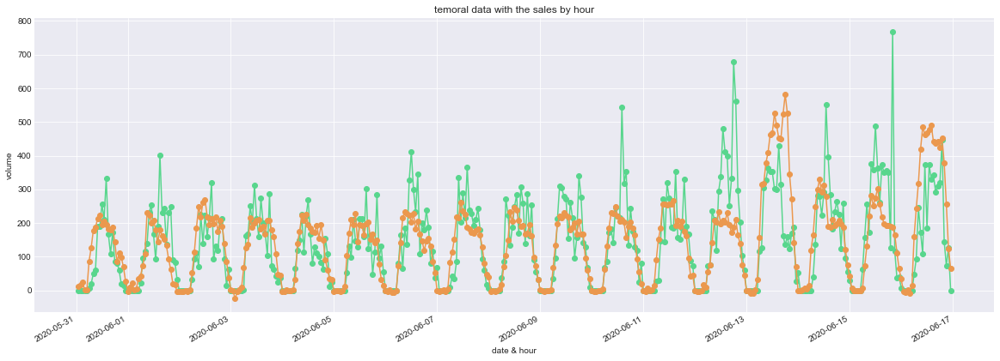

The charts above indicate that while the Mean Absolute Error (MAE) exceeds the base rate, there's still potential for improvement in our forecasting techniques.

In our pursuit of enhancing forecast accuracy, we've integrated additional exogenous variables into our analysis. These variables aim to improve pattern recognition and forecasting precision, with factors like the day of the week, pricing fluctuations, and holiday presence identified as key contributors to sales volume.

Following the retraining of our model with these additional variables, we achieved an MAE of 63.4, surpassing our baseline of 77. This significant improvement underscores the effectiveness of including exogenous variables in identifying patterns and enhancing accuracy. To further refine our model, we conducted an optimization process, resulting in a reduced MAE of 61.7.

The accompanying chart demonstrates the predictions prior to hyperparameter optimization, showcasing improved capture of sales behavior and trends.

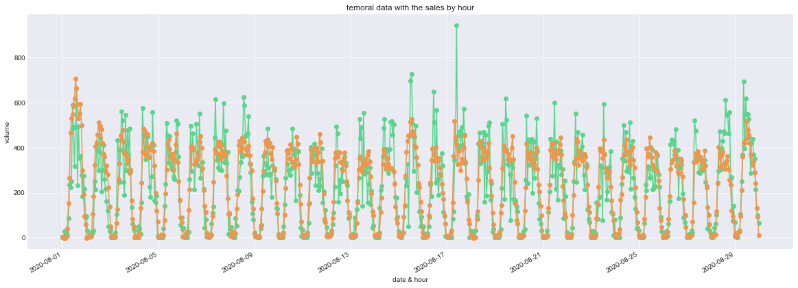

`SHAP`

Our primary objective is to uncover the pivotal features that drive predictions within our model and evaluate their alignment with significant factors identified in our prior causal analysis.

SHAP, shorthand for SHapley Additive exPlanations, serves as a powerful tool in the realm of machine learning, offering insights into the rationale behind a model's predictions. Operating akin to attributing credit in team sports, SHAP assigns a "credit" to each feature in a prediction, signifying its contribution to the outcome. By shedding light on the most influential features and their respective contributions, SHAP facilitates a deeper comprehension and interpretation of intricate machine learning models.

As depicted in the chart below, certain variables such as hour, price, weekday, and holiday status emerge as robust predictors for the forecaster, aligning with the findings from our earlier causal analysis.

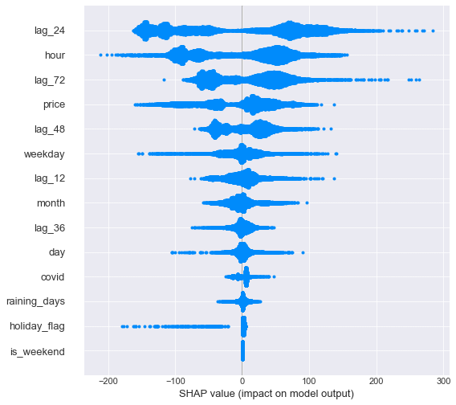

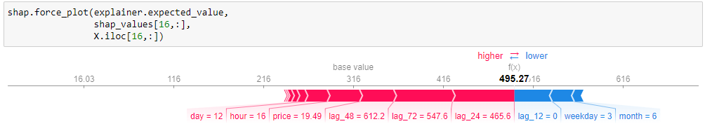

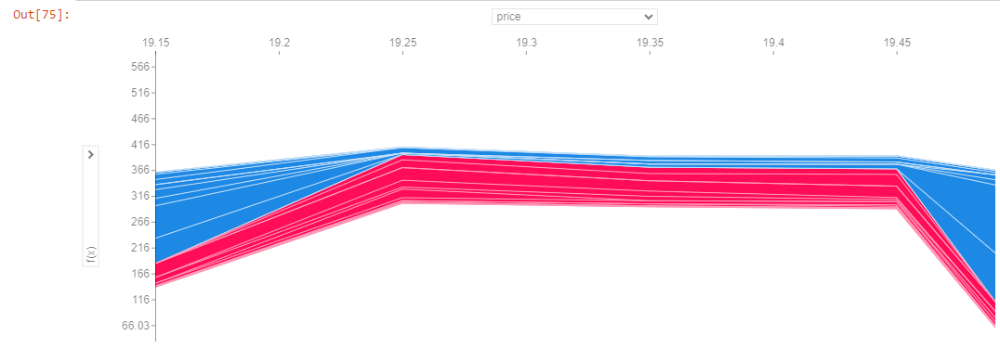

An essential aspect to emphasize is the significant influence of pricing, as corroborated by our prior analysis. It's evident that pricing has a considerable impact on sales, exerting a negative effect.

### Conclusions

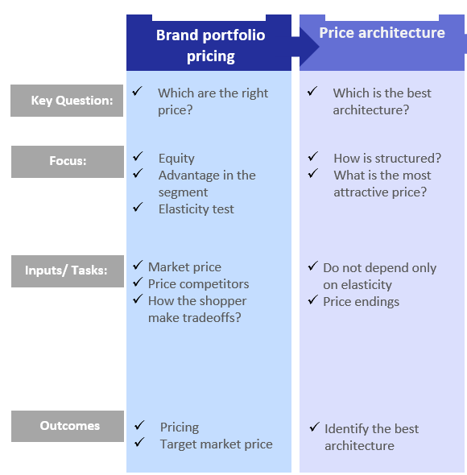

As we journey through the significant phases of our revenue management roadmap, we embark on a profound exploration of discovery and strategy. Our expedition begins with a comprehensive understanding of consumer behavior—a pivotal step in navigating our path to market success. Through meticulous analysis, we uncover the intricate dynamics of consumer purchasing patterns, discerning the nuances of their engagement with our products and services. From the timing of purchases to the influence of external factors like weather conditions and holidays, we scrutinize every variable to gain deeper insights into consumer behavior.

Armed with this invaluable knowledge, we progress to the next stage of our journey—a phase characterized by data-driven insights and strategic decision-making. Our causal analysis endeavors to validate hypotheses and unearth the causal effects of exogenous variables. This rigorous examination not only confirms our assumptions but also sheds light on the underlying drivers of consumer behavior, from pricing elasticity to the complex interplay of market dynamics.

However, our journey does not culminate with analysis alone. We venture further, exploring avenues to optimize our pricing strategy based on newfound insights. Through meticulous experimentation and fine-tuning, we aim to unlock the full potential of our pricing model, ensuring its alignment with market demands and consumer preferences.

As we reflect on our odyssey thus far, we recognize that our roadmap to revenue management transcends mere analysis—it embodies our unwavering commitment to innovation and excellence. Our journey not only furnishes invaluable insights into future sales behavior but also equips us with the foresight to anticipate market shifts and adapt proactively.

In addition to our analytical voyage, it's essential to acknowledge the invaluable support provided by the policy interpreter from `Econml.` While this tool initially suggested strategies such as price decreases, it also illuminated scenarios where increasing prices, particularly on rainy days, could yield greater benefits. However, our considerations extend beyond mere price adjustments. 

Another thing to consider in the future is we need delve into the intricacies of pricing architecture, exploring the impact of price endings and the subtle nudges they create for consumers. Moreover, we recognize the significance of peak hours and the potential for profit optimization through dynamic pricing strategies. By strategically adjusting prices based on demand fluctuations, we not only enhance profitability but also tailor our offerings to meet consumer needs effectively. This multifaceted approach underscores our commitment to maximizing value and driving sustainable growth in an ever-evolving marketplace.

Based on the insights gained from our analysis, we recommend the following pricing strategiesa nd next steps:

- **Day of the week pricing strategy:** Implement a dynamic pricing strategy based on the day of the week. Consider adjusting prices to reflect consumer demand patterns, increasing or decreasing prices accordingly.
- **Holiday pricing:** During holidays, capitalize on increased consumer spending by strategically raising prices to optimize profitability.
- **Hourly pricing:** Align with dynamic pricing by adjusting prices throughout the day based on demand fluctuations. Leverage peak hours to maximize revenue potential.
- **Pricing endings analysis:** Delve into the impact of price endings on consumer behavior. Understand how price points influence purchasing decisions and adjust pricing accordingly.
- **Cross-elasticity analysis:** Analyze the effects of market price changes on sales variations. Calculate cross-elasticity to assess how adjustments in market prices impact consumer demand and tailor pricing strategies accordingly.

By implementing these pricing strategies, you can not only optimize revenue but also better meet consumer needs and enhance overall profitability.

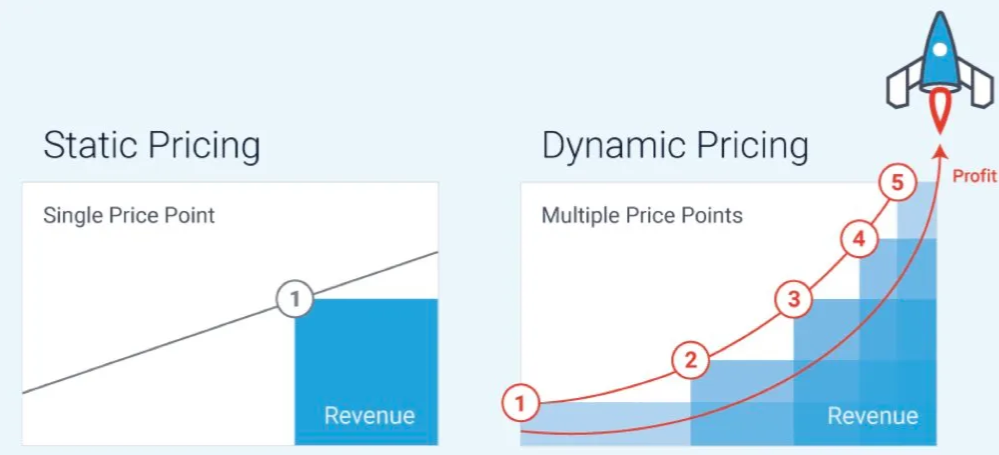

